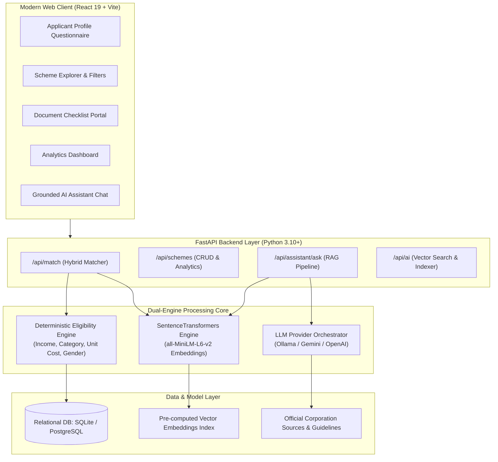

# 🇮🇳 SIH26092 — UdyamMarg (उद्यम मार्ग)
### AI-Driven Concessional Credit & Government Scheme Recommendation Platform for Marginalized Entrepreneurs

[](https://www.sih.gov.in/)
[](https://fastapi.tiangolo.com)
[](https://react.dev/)
[](https://vitejs.dev/)
[](https://huggingface.co/sentence-transformers/all-MiniLM-L6-v2)
[](https://ollama.com)
[](LICENSE)

---

## 📌 Executive Summary & Problem Context

In India, statutory welfare corporations and central ministries provide a rich spectrum of concessional credit schemes, capital subsidies, and affirmative entrepreneurship assistance. However, marginalized beneficiaries—including **Scheduled Castes (SC)**, **Scheduled Tribes (ST)**, **Other Backward Classes (OBC)**, **Minorities**, **Women Entrepreneurs**, and **Traditional Artisans / Vishwakarmas**—frequently face severe hurdles:

1. **Information Asymmetry**: Scheme details are scattered across disparate portals (NSFDC, NSTFDC, NBCFDC, NMDFC, KVIC, SIDBI).
2. **Complex Eligibility Criteria**: Convoluted rules involving income ceilings, unit cost limits, margin money requirements, and sector exclusions lead to high rejection rates.
3. **Documentation Friction**: Lack of clarity on required caste certificates, income certificates, and Detailed Project Reports (DPRs).
4. **AI Hallucination Risks**: Generic generative chatbots often invent non-existent grants or provide inaccurate eligibility advice to vulnerable applicants.

**UdyamMarg (SIH26092)** solves these challenges through a **two-tier architecture**:
- **Deterministic Hard Eligibility Engine**: Evaluates statutory rules (income ceilings, beneficiary category, gender reservations, project cost caps) with 100% auditability and zero hallucination.
- **Provider-Agnostic Grounded RAG AI**: Employs local semantic vector embeddings (`all-MiniLM-L6-v2`) and a Grounded Retrieval-Augmented Generation pipeline (supporting local private Ollama models, Google Gemini, and OpenAI) with source citations and confidence metrics.

---

## ✨ Key Features & Capabilities

### 🎯 1. Explainable Rule-Based Eligibility Engine
- Deterministic rule verification executing statutory requirements for every scheme.
- Auditable output containing:
  - Explicit **eligibility status** (`true` / `false`).
  - **Positive qualification reasons** (e.g., *“Eligible for PMEGP Special Category 35% capital subsidy”*).
  - **Failed rule diagnostics** (e.g., *“Annual income ₹6,00,000 exceeds NSFDC ceiling of ₹5,00,000”*).

### 🧠 2. Hybrid Multi-Factor Recommendation (70/30 Model)
- **70% Hard Rule Compliance**: Quantifies financial suitability, project budget fit, and category alignment.
- **30% Semantic Relevance**: Calculates vector cosine similarity between applicant trade descriptions (e.g., *"organic dairy farm"*, *"e-rickshaw fleet"*, *"handloom embroidery"*) and scheme trade taxonomies.
- Ensures statutory eligibility is strictly preserved while ranking the best-suited schemes at the top.

### 🤖 3. Provider-Agnostic Grounded RAG Assistant
- Conversational multilingual assistant grounded on verified statutory scheme guidelines.
- **Local Private Inference**: First-class support for **Ollama** (`qwen2.5-coder:3b` / Qwen models) running 100% locally with zero data leakage.
- **Cloud LLM Support**: Instant toggle to **Google Gemini** (`gemini-2.5-flash`) or **OpenAI** (`gpt-5-mini`).
- Returns grounded answers, evidence snippets, similarity scores, provider attribution, and official source links.

### 🔍 4. Scheme Explorer & Smart Filter Matrix
- Live search across all schemes by keywords, beneficiary category (SC, ST, OBC, Minority, General, Women), and industry sectors (Manufacturing, Agriculture, Services, Green Energy, Artisans).
- Direct comparison of interest rates (from 4.0% to 15.0%), repayment tenure (up to 10 years), moratorium periods, and channelizing agencies.

### 📋 5. Dynamic Document Checklist Generator
- Generates a customized, interactive document readiness checklist for any matched scheme.
- Outlines exact required verifications (Caste Certificates, Income Certificates, Aadhaar & PAN, DPR, Pehchan/Artisan ID, Training Certificates).

### 📊 6. Real-time Impact & Analytics Dashboard
- Live dashboard displaying:
  - Total schemes indexed and total credit pool capacity (₹ Crores).
  - Target community allocation breakdowns.
  - Average beneficiary interest rates across corporations.
  - Registered channel partners (SCAs, RRBs, PSBs, MFIs, CSCs).

### ⚙️ 7. Dynamic Admin & Knowledge Base Portal
- Scheme authoring and management interface.
- Automatic vector index rebuilding upon adding or modifying scheme parameters.

---

## 🏛️ Statutory Corporations & Schemes Covered

| Corporation / Ministry | Scheme Name | Target Beneficiary | Max Loan / Project Cost | Interest Rate | Repayment / Moratorium |
| :--- | :--- | :--- | :--- | :--- | :--- |
| **NSFDC** | **Micro Finance Scheme (MFS)** | SC Entrepreneurs | Up to ₹1.40 Lakh | 6.5% p.a. | 3 Yrs (3 Mo Moratorium) |
| **NSFDC** | **Aajeevika Micro-Finance (AMY)** | SC Entrepreneurs (NBFC-MFI) | Up to ₹1.40 Lakh | 15.0% p.a. | 3 Yrs (3 Mo Moratorium) |
| **NSFDC** | **NSFDC Term Loan (TL)** | SC Entrepreneurs | ₹1.40L to ₹50.00 Lakh | 8.0% p.a. | 7 Yrs (6 Mo Moratorium) |
| **NSFDC** | **Udyam Nidhi Yojana (UNY)** | SC Entrepreneurs | Up to ₹5.00 Lakh | 13.0% p.a. | 5 Yrs (3 Mo Moratorium) |
| **NSFDC** | **Mahila Samriddhi Yojana (MSY)** | SC Women Entrepreneurs | Up to ₹1.40 Lakh | **4.0% p.a.** | 3 Yrs (3 Mo Moratorium) |
| **NSFDC** | **Green Business Scheme (GBS)** | SC Green Initiatives (E-vehicles/Solar) | Up to ₹30.00 Lakh | 6.0% p.a. | 7 Yrs (6 Mo Moratorium) |
| **NSTFDC** | **NSTFDC Term Loan Scheme** | ST Entrepreneurs | Up to ₹50.00 Lakh | 6.0% p.a. | 10 Yrs (12 Mo Moratorium) |
| **NSTFDC** | **Adivasi Mahila Sashaktikaran (AMES)**| ST Women Entrepreneurs | Up to ₹2.00 Lakh | **4.0% p.a.** | 5 Yrs (6 Mo Moratorium) |
| **NBCFDC** | **NBCFDC General Loan Scheme (GLS)**| OBC (Non-Creamy Layer) | Up to ₹15.00 Lakh | 7.0% p.a. | 8 Yrs (6 Mo Moratorium) |
| **NBCFDC** | **New Swarnima Scheme** | OBC Women Entrepreneurs | Up to ₹2.00 Lakh | **5.0% p.a.** | 8 Yrs (6 Mo Moratorium) |
| **NMDFC** | **NMDFC Term Loan** | Minority Entrepreneurs | Up to ₹30.00 Lakh | 6.0% p.a. | 5 Yrs (6 Mo Moratorium) |
| **NMDFC** | **Virasat Scheme** | Minority Artisans & Craftsmen | Up to ₹10.00 Lakh | 4.5% p.a. | 5 Yrs (6 Mo Moratorium) |
| **MSME / KVIC** | **PMEGP** | All (SC/ST/OBC/Women/Minority) | Up to ₹50.00 Lakh | 8.5% (Up to **35% Subsidy**) | 7 Yrs (6 Mo Moratorium) |
| **MSME** | **PM Vishwakarma Scheme** | 18 Traditional Artisan Trades | Up to ₹3.00 Lakh | **5.0% (Collateral-Free)** | 3 Yrs + ₹15,000 Toolkit |
| **SIDBI / DFS** | **Stand-Up India Scheme** | SC / ST / Women Greenfield Projects| ₹10.00 Lakh to ₹1.00 Crore | 9.25% p.a. | 7 Yrs (18 Mo Moratorium) |
| **MUDRA** | **Pradhan Mantri MUDRA (PMMY)** | Micro Units (Shishu/Kishor/Tarun) | Up to ₹10.00 Lakh | 9.5% p.a. | 5 Yrs (6 Mo Moratorium) |

---

## 🏗️ System Architecture



---

## 💻 Tech Stack

| Layer | Technologies Used |
| :--- | :--- |
| **Frontend UI** | React 19, Vite, Lucide React, React Markdown, Modern Responsive Glassmorphic CSS |
| **Backend API** | FastAPI, Python 3.10+, Uvicorn, Pydantic v2, Pydantic-Settings |
| **Database & ORM** | SQLAlchemy 2.0, SQLite (Local Development), PostgreSQL 16 (Production/Docker) |
| **Vector Search & NLP** | Sentence-Transformers (`all-MiniLM-L6-v2`), NumPy Cosine Similarity Matrix |
| **LLM & RAG Engine** | Ollama (Local `qwen2.5-coder:3b`), Google Gemini API (`gemini-2.5-flash`), OpenAI API (`gpt-5-mini`), HTTPX |
| **Testing & Tooling** | Pytest, Oxlint, Docker, Docker Compose |

---

## 📂 Project Structure

```text
sih26092/
├── README.md                      # Complete Project Documentation & SIH Guide
├── start.sh                       # One-command unified launcher script
├── docker-compose.yml             # Docker multi-container service setup
│
├── backend/                       # FastAPI Backend Application
│   ├── Dockerfile                 # Backend containerization
│   ├── requirements.txt           # Python dependencies
│   ├── sih26092.db                # SQLite database (with pre-seeded schemes)
│   ├── .env.example               # Environment variables template
│   ├── app/
│   │   ├── main.py                # FastAPI entry point & CORS configuration
│   │   ├── seed.py                # Complete statutory scheme database seed script
│   │   ├── ai/                    # AI, Embeddings & RAG Implementation
│   │   │   ├── embeddings.py      # SentenceTransformer model wrapper
│   │   │   ├── hybrid.py          # 70/30 Hybrid matching algorithm
│   │   │   ├── prompts.py         # Grounded prompt engineering & guardrails
│   │   │   ├── rag.py             # Grounded retrieval-augmented generation pipeline
│   │   │   ├── retriever.py       # Semantic vector indexing and top-k search
│   │   │   └── llm/               # Provider-agnostic LLM client implementations
│   │   │       ├── base.py        # Base LLM provider abstract class
│   │   │       ├── factory.py     # Provider factory (Ollama / Gemini / OpenAI)
│   │   │       ├── ollama.py      # Ollama local HTTP inference client
│   │   │       ├── gemini.py      # Google Gemini REST client
│   │   │       └── openai.py      # OpenAI REST client
│   │   ├── api/                   # FastAPI Router Endpoints
│   │   │   ├── schemes.py         # Scheme search, filter, CRUD & analytics
│   │   │   ├── matching.py        # Eligibility evaluation & ranking endpoint
│   │   │   ├── assistant.py       # Conversational RAG assistant endpoint
│   │   │   └── ai.py              # Vector index rebuild & semantic search
│   │   ├── core/                  # Core settings & configuration management
│   │   │   └── config.py          # Pydantic BaseSettings (.env loader)
│   │   ├── db/                    # Database session & base declarative models
│   │   │   └── session.py         # SQLAlchemy engine & session factory
│   │   ├── models/                # SQLAlchemy ORM Models
│   │   │   └── scheme.py          # Scheme database schema definition
│   │   ├── schemas/               # Pydantic Schemas & DTOs
│   │   │   ├── matching.py        # ApplicantInput, MatchResponse, SchemeMatch
│   │   │   └── assistant.py       # AssistantRequest, AssistantResponse
│   │   └── services/              # Business Logic & Rules
│   │       └── eligibility.py     # Hard eligibility evaluation engine
│   └── tests/                     # Unit & integration test suite
│       ├── test_eligibility.py    # Hard eligibility test cases
│       ├── test_ai.py             # Vector retriever unit tests
│       └── test_phase3.py         # RAG pipeline test cases
│
└── frontend/                      # React 19 + Vite Frontend Application
    ├── package.json               # Node dependencies & scripts
    ├── vite.config.js             # Vite configuration
    ├── index.html                 # HTML application template
    ├── src/
    │   ├── main.jsx               # React entry point
    │   ├── App.jsx                # Main application component & navigation
    │   ├── App.css                # Layout styles
    │   ├── index.css              # Design system & dark/glassmorphic CSS variables
    │   └── components/            # Modular React UI Components
    │       ├── Navbar.jsx         # Navigation bar with language selector
    │       ├── HeroBanner.jsx     # Hero section with quick stats & CTA
    │       ├── SchemeMatcher.jsx  # Interactive eligibility assessment form
    │       ├── AssistantChat.jsx  # Grounded RAG AI Assistant chat interface
    │       ├── SchemeExplorer.jsx # Scheme catalog with instant filtering
    │       ├── DocumentChecklist.jsx # Dynamic requirement checklist generator
    │       ├── AnalyticsDashboard.jsx # Financial & beneficiary impact graphs
    │       └── AdminPortal.jsx    # Scheme management & vector reindexing
```

---

## 🚀 Quick Start Guide

### Option 1: One-Click Startup Script (Recommended)

The easiest way to launch the entire platform (Ollama check, Database seed, Vector Indexing, FastAPI Backend, and React Frontend):

```bash
chmod +x start.sh
./start.sh
```

- **Frontend Application**: `http://localhost:5173`
- **Backend Swagger API Docs**: `http://localhost:8000/docs`
- **Health Check**: `http://localhost:8000/health`

---

### Option 2: Manual Step-by-Step Installation

#### Step 1: Clone and Navigate to Directory
```bash
cd /path/to/sih26092
```

#### Step 2: Setup and Run Backend
```bash
cd backend

# Create & activate virtual environment
python3 -m venv .venv
source .venv/bin/activate

# Install dependencies
pip install -r requirements.txt

# Create .env from template
cp .env.example .env

# Seed the database with statutory schemes
python app/seed.py

# Build the semantic vector index
python -c "from app.ai.retriever import build_index; res = build_index(); print('Indexed', len(res['documents']), 'documents')"

# Start FastAPI backend server
uvicorn app.main:app --host 0.0.0.0 --port 8000 --reload
```

#### Step 3: Setup and Run Frontend
In a new terminal window:
```bash
cd frontend

# Install Node dependencies
npm install

# Start Vite development server
npm run dev -- --port 5173
```

#### Step 4: Setup Local AI (Ollama - Optional for RAG)
Install and run [Ollama](https://ollama.com/), then pull the lightweight code/reasoning model:
```bash
ollama pull qwen2.5-coder:3b
ollama serve
```

---

### Option 3: Switching AI Providers (Ollama / Gemini / OpenAI)

Configure `backend/.env`:

#### Local Ollama (Default - Offline & Free):
```env
LLM_PROVIDER=ollama
OLLAMA_URL=http://localhost:11434
OLLAMA_MODEL=qwen2.5-coder:3b
```

#### Google Gemini:
```env
LLM_PROVIDER=gemini
GEMINI_API_KEY=AIzaSy...your_gemini_key
GEMINI_MODEL=gemini-2.5-flash
```

#### OpenAI:
```env
LLM_PROVIDER=openai
OPENAI_API_KEY=sk-proj-...your_openai_key
OPENAI_MODEL=gpt-5-mini
```

---

### Option 4: Docker Compose Setup

Run the full stack with PostgreSQL and FastAPI in Docker:

```bash
docker compose up --build
```

---

## 📡 REST API Reference

| Method | Endpoint | Description |
| :--- | :--- | :--- |
| `POST` | `/api/match` | Evaluate applicant details against statutory rules & compute hybrid 70/30 scores |
| `GET` | `/api/schemes` | List and filter active schemes (supports `?category=`, `?sector=`, `?search=`) |
| `GET` | `/api/schemes/{id}` | Get complete detail, documents, and rules for a specific scheme |
| `GET` | `/api/schemes/analytics` | Get aggregate statistics (community breakdown, loan pools, average rates) |
| `POST` | `/api/schemes` | Add a new scheme (Admins) & auto-trigger vector index rebuild |
| `POST` | `/api/assistant/ask` | Query the Grounded RAG AI Assistant with top-k evidence retrieval |
| `POST` | `/api/ai/search` | Perform raw semantic vector search over scheme corpus |
| `POST` | `/api/ai/index` | Trigger manual re-indexing of vector embeddings |
| `GET` | `/health` | Service health status |

### Example Scheme Match Request:
```bash
curl -X POST http://localhost:8000/api/match \
  -H "Content-Type: application/json" \
  -d '{
    "name": "Ramesh Kumar",
    "age": 28,
    "gender": "male",
    "category": "SC",
    "annual_family_income": 250000,
    "state": "Maharashtra",
    "district": "Pune",
    "project_cost": 450000,
    "business_type": "transport",
    "business_description": "Purchasing commercial electric auto rickshaw for urban logistics"
  }'
```

---

## 🧪 Running Automated Tests

Run backend unit tests for hard eligibility, vector retrieval, and RAG pipelines:

```bash
cd backend
source .venv/bin/activate
pytest -v
```

Run frontend lint check:
```bash
cd frontend
npm run lint
```

---

## 🛡️ Safety, Explainability & Anti-Hallucination Guardrails

1. **Decoupled Architecture**: Generative LLMs are **never** permitted to evaluate or override statutory eligibility. Eligibility decisions are strictly executed by deterministic Python logic in `app/services/eligibility.py`.
2. **Grounded In-Context Generation**: RAG prompts mandate that the model relies exclusively on retrieved corpus context and explicitly states when information is unavailable.
3. **Auditable Source Attribution**: Every scheme recommendation includes direct official government portal links (e.g., `https://nsfdc.nic.in`, `https://kviconline.gov.in`).
4. **Data Privacy**: No beneficiary PII is logged or transmitted to external AI providers when using local Ollama inference.

---

## 👥 Team & Hackathon Submission
- **Project**: SIH26092 — UdyamMarg
- **Track**: Smart India Hackathon — Concessional Credit & Affirmative Action for Marginalized Communities
- **Core Focus**: SC/ST/OBC/Minority/Women Entrepreneurship, MSME Scheme Matching, Grounded Generative AI
